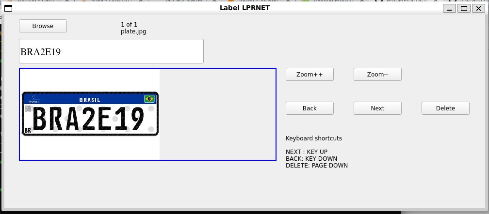

# Label LPRNET
Label_LPRNET  is a graphical image annotation tool for build/validate Dataset in LPRNET Format. Nvidia LPRNet (License Plate Recognition Net).




### Requirement
- python3
- pyQt5
- opencv-python

### New Features
- Save Last Session. i.e When reopen dir it continues from the last image that was processed.
- Added Delete Function
+ Added Shortcuts 
	*  NEXT : KEY UP
	*  BACK : KEY DOWN
	*  DELETE : PAGE DOWN
- Changed Layout
    
### Dataset LPRNET Format:
- Each cropped license plate image has a corresponding label text file that contains one line of characters in the specific license plate. 
it should follow this dataset structure
```
DATA_DIR
├── train
│   ├── characters.txt
│   ├── image
│   │   ├── image_name_1.jpg
│   │   ├── image_name_2.jpg
|   |   ├── ...
│   └── label
│       ├── image_name_1.txt
│       ├── image_name_2.txt
|       ├── ...
└── val
    ├── characters.txt
    ├── image
    │   ├── image_name_11.jpg
    │   ├── image_name_12.jpg
    |   ├── ...
    └── label
        ├── image_name_11.txt
        ├── image_name_12.txt
        ├── ...
The file name should be same for image and label folders
```

##  Instructions:
When Browser a DIR please choose Root_DIR  eg. `/tmp/train_01`

The `/tmp/train_01`  must contain `image` and `label` dirs

image dir : All images

label dir : All txt files


## License
MIT
**Free Software, Hell Yeah!**
